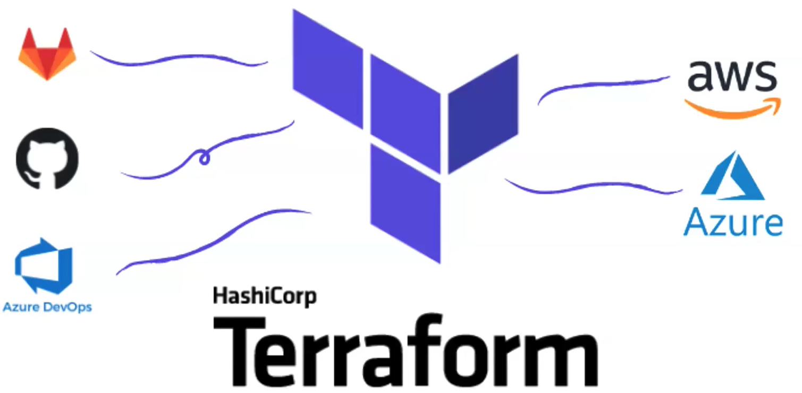
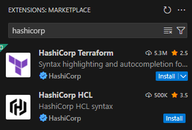
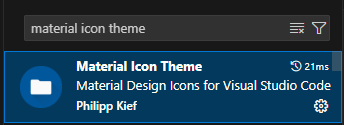

# Terraform Projects

Hands-on terraform projects developed during courses and studies.

[Code Repository Reference](https://gitlab.com/terraform-basico-ao-avancado?page=1)

### Objective
Apply terraform concepts and create Infrastructure-As-Code for multicloud (AWS, Azure) using CI/CD pipelines. 

To following all examples you only need an account for **AWS** and **Azure** (**even after free tier**).

### Pre-requirements

**WSL2**

It's necessary install WSL2 if you are Windows user, to do it [click here](https://learn.microsoft.com/pt-br/windows/wsl/install). In my case I choose more recent Ubuntu OS version.

1. Run powershell as administrator
2. Execute "wsl -l -o" to list all OS versions available to install
3. Choose your version, copy name and execute the following command "wsl --install -d OS_VERSION_NAME"
4. Now will ever use Ubuntu console to run all terraform commands

**Remember:** If you decided to use wsl2 it's not necessary to install Terraform directly on windows. I'll use wsl to do it.

**TERRAFORM**

Here we will install Terraform using WSL2. [Click here to install Terraform](https://developer.hashicorp.com/terraform/tutorials/aws-get-started/install-cli#install-terraform).

- To select the specific terraform version to install, you can use "sudo apt policy terraform" to list all versions, and then run "sudo apt-get install terraform=VERSION"

Important links:
- [Terraform Documentation](https://developer.hashicorp.com/terraform/language)
- [Providers](https://registry.terraform.io/browse/providers)
- [Modules](https://registry.terraform.io/browse/modules)

Important vs code extentions that could help.
  
